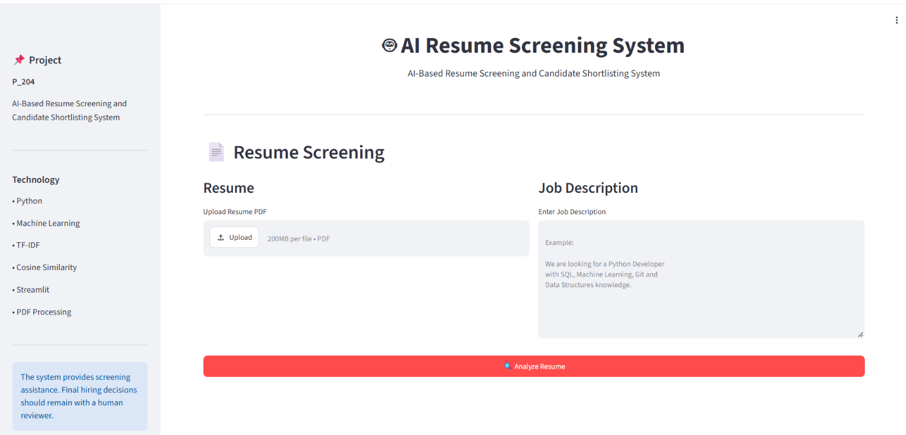

# 🤖 AI-Based Resume Screening and Candidate Shortlisting System

An AI-powered resume screening system that analyzes a candidate's resume
against a job description and generates a candidate-job matching score
using Natural Language Processing (NLP), TF-IDF, cosine similarity,
skill matching, and machine learning.

## 📌 Project Overview

Recruiters often receive a large number of resumes for a single job
opening. Manual screening can be time-consuming and inconsistent. This
project provides an AI-assisted screening system that extracts
information from resumes, compares it with job requirements, and
provides useful screening insights.

The system is designed as a **decision-support tool**. Final hiring
decisions should remain with a human reviewer.

## 🎯 Objectives

-   Extract text from resume PDFs.
-   Preprocess resume and job-description text.
-   Identify candidate and required skills.
-   Compare resume and job-description content using TF-IDF and cosine
    similarity.
-   Calculate skill matching and other matching features.
-   Use a trained machine learning model to estimate the matching score.
-   Display matched and missing skills.
-   Provide an interactive Streamlit interface for resume screening.

## 🔄 Project Workflow

``` text
Resume PDF + Job Description
            ↓
      PDF Text Extraction
            ↓
       Text Preprocessing
            ↓
       Skill Extraction
            ↓
          TF-IDF
            ↓
     Cosine Similarity
            ↓
      Feature Engineering
            ↓
      Machine Learning Model
            ↓
       Matching Score
            ↓
     Screening & Analysis
```

## 🧠 Machine Learning Approach

The project uses the following techniques:

-   **TF-IDF** for converting text into numerical features.
-   **Cosine Similarity** for measuring similarity between resume and
    job-description text.
-   **Skill Matching** for identifying required skills present in a
    candidate's resume.
-   **Feature Engineering** using similarity, skill coverage, word
    overlap, skill counts, resume length, and job-description length.
-   **Regression Models** including Linear Regression, Random Forest,
    Extra Trees, and Gradient Boosting.
-   **Cross-validation** for evaluating model performance.

## 📊 Features Used by the Model

The trained model uses:

-   `similarity_score`
-   `skill_match`
-   `skill_coverage`
-   `word_overlap`
-   `candidate_skill_count`
-   `required_skill_count`
-   `matched_skill_count`
-   `resume_length`
-   `job_length`
-   `resume_word_count`
-   `job_word_count`

## 🛠️ Technologies Used

-   Python
-   Pandas
-   NumPy
-   Scikit-learn
-   TF-IDF
-   Cosine Similarity
-   PyPDF
-   Joblib
-   Streamlit
-   Google Colab / VS Code
-   Jupyter Notebook

## 💻 Application Features

-   📄 Resume PDF upload
-   📝 Job description input
-   🔍 Resume text extraction
-   🧠 AI-based matching
-   🛠️ Skill extraction
-   📊 Matching score
-   ✅ Matched skills
-   ❌ Missing skills
-   📈 Resume and job statistics
-   🌐 Interactive Streamlit frontend

## 🖥️ Application Screenshot



## 📂 Project Structure

``` text
P_204_Resume_Screening/
│
├── AI-Based Resume Screening and Candidate Shortlisting System.ipynb
├── README.md
└── project-screenshot.png
```

> The trained model files and Streamlit application files can be
> generated from the notebook during project setup.

## 🚀 How to Run

### 1. Clone the repository

``` bash
git clone https://github.com/PradhanMahatha/AI-BASED-RESUME-SCREENING-AND-CANDIDATE-SHORTLISTING-SYSTEM.git
cd AI-BASED-RESUME-SCREENING-AND-CANDIDATE-SHORTLISTING-SYSTEM
```

### 2. Open the notebook

Open:

``` text
AI-Based Resume Screening and Candidate Shortlisting System.ipynb
```

Run the cells to perform preprocessing, feature engineering, model
training, evaluation, and frontend setup.

### 3. Run the Streamlit application

After generating the required model files and `app.py`:

``` bash
streamlit run app.py
```

## ⚠️ Important Note

This system is intended to assist recruiters with resume screening and
candidate-job matching. It should not be used as the sole basis for
hiring, rejection, or other employment decisions.

## 👨‍💻 Project

**Project ID:** P_204\
**Project Title:** AI-Based Resume Screening and Candidate Shortlisting
System

## 📜 License

This project is created for academic/project work and learning purposes.
